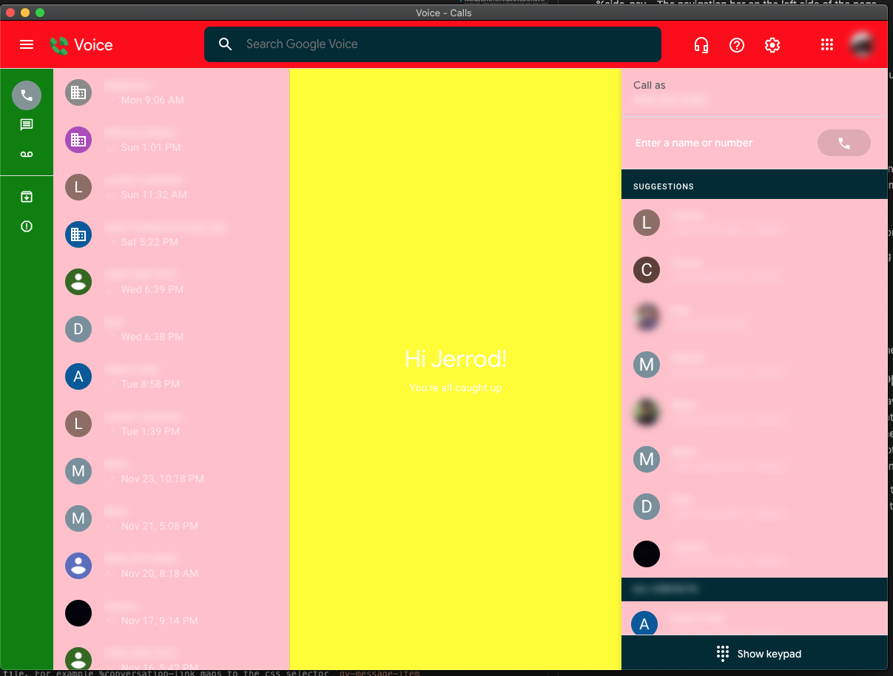

# Contributing a theme
So you want to add a theme? Themeing google voice is fairly complex, I tried to modularize it as much as possible so that other people could add themes. Theres several different levels of creating a theme.
If all you want to do is create a theme that looks like one of the existing themes then:
1. Setup a fork of this repository
2. Run `npm install` to fetch dependencies
3. Then just copy that themes `src/themes/.scss` file and create a new theme with a new name
4. Modify the color palette with the colors that you want.
5. Then go into `src/pages/customize.html` and add a new option tag like so `<option value="THEME FILE NAME WITHOUT .scss">THEME NAME</option>`
6. Run `npm run start` to start the app and test your theme

 ## Building a custom theme
 If you really hate yourself and you want to build a custom theme or theme some specific part of the application a different way then you certainly can do that. I tried to break down the page into somewhat logical pieces and allow you to style those specific pieces. There are 5 main components that you can style, and there are base styles applied to these components in the `base.scss` file. This file does basic things like set background / foreground colors. 
 Fair warning, since I was attemping to simiplify it greatly, some of the generated selectors can be very complex and match many things that might not be intended. If you are having trouble please reach out to me on discord.
 
 The page is broken down into 5 main components, each with sub components underneath. You can reference these components by using scss placeholder selectors (%navbar for example)

%navbar - The navigation bar at the top of the page
- %navbar-title - The title that says "Voice"
- %navbar-search - The search bar

**Note: I frequently style svgs as well but I didnt give them a placeholder name, you can style them like so `%navbar-search svg` would allow you to style or change the color of the search inputs icon**


%side-nav - The navigation bar on the left side of the page

- %side-nav-item - Each item in the bar
- %side-nav-item-active - The currently selected item
- %side-nav-item-badge - The badge when you have an unread message

%conversation
- %conversation-header - The header container at the top of the conversation
- %conversation-title - Title at the top of the conversation in the header
- %conversatpon-footer - Footer / send message box at the bottom of the conversation
- %conversation-summary - Summary when no thread is selected (1 new message etc)
- %conversation-message-recieved - Message recieved bubble
- %conversation-message-sent - Message sent bubble
- %conversation-timestamp - Message timestamp
- %conversation-link - Link inside of a message

%lists - All of the lists inside voice. Messages, voicemails, search results etc.
- %list-item - An item inside the list, is also sometimes the cards at the top of lists (contact card etc)
- %list-item-active - Currently active item, only used in message threads and voicemails afaik
- %list-item-heading - Primary text field inside an item (eg. Name)
- %list-item-detail - Secondary text field inside an item (eg. Phone number)

%dial-pad - Dial pad on the right side when on phone tab
- %dial-pad-button - A button inside the dial pad
- %dial-pad-toggle - The toggle to show / hide the dial pad

The easiest way to visualize these components is to create a new theme with background colors for each component. Create a new theme as mentioned in the first section or overwrite one of the existing ones. For example doing this:

```@use 'base';

/** Hacky border color fix for conversation list */
%conversation {
    background-color: yellow;
}

/** Note: I used %list-item instead of %lists because seting bg on %lists wont do anything */
%list-item {
    background-color: pink;
}

%navbar {
    background-color: red;
}

%side-nav {
    background-color: green;
}

%dial-pad {
    background-color: blue;
}
```

Gives us the follow output so we can easily tell which component is which.


## More complex themeing and modifying mappings.scss
You are really asking for it huh... If you continue you should have at least a decent understanding of css and css selectors, and possibly scss as well.
Alright fine. The way this crazy shit works is that all of the components map to a selector or a group of selectors within the app. If you want to see what a certain component maps to (%navbar for example) you
can look at the `src/themes/mappings.scss` file. For example %conversation-link maps to the css selector `gv-message-item gv-annotation a`. Most of them are not this simple. Some of them map to many different things, for example list-item has like 10 different mappings because we have to style all the components that can possibly show up inside our lists.

If you need to target a component specifically for your theme then you can always include a one-off css selector in your theme, its going to work fine but I would recommend talking to me and trying to understand my thought process when creating these components
and perhaps it makes sense to pull out another component by itself.